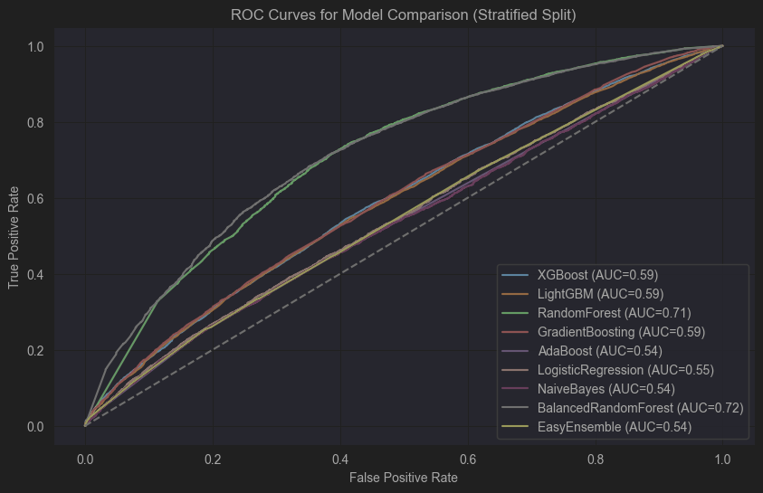

# Olist Customer Churn Prediction - Model Comparison Report

This project compares several machine learning models for predicting customer churn using the Olist dataset. The goal is to evaluate their performance under a stratified train-test split with engineered features.

## Models Evaluated
We trained and evaluated the following models:
- **XGBoost**
- **LightGBM**
- **RandomForestClassifier**
- **GradientBoostingClassifier**
- **AdaBoostClassifier**
- **LogisticRegression**
- **Gaussian Naive Bayes**
- **BalancedRandomForestClassifier**
- **EasyEnsembleClassifier**

## Summary of Results (ROC AUC + Metrics)
| Model                    | ROC AUC | Accuracy | Precision (0/1) | Recall (0/1) | F1-score (0/1) |
|--------------------------|---------|----------|----------------|--------------|----------------|
| **XGBoost**               | 0.59    | 0.54     | 0.35 / 0.76    | 0.62 / 0.51  | 0.44 / 0.61    |
| **LightGBM**              | 0.59    | 0.54     | 0.35 / 0.76    | 0.62 / 0.51  | 0.44 / 0.61    |
| **RandomForest**          | 0.71    | 0.71     | 0.50 / 0.80    | 0.54 / 0.77  | 0.52 / 0.79    |
| **GradientBoosting**      | 0.59    | 0.71     | 0.78 / 0.70    | 0.01 / 1.00  | 0.02 / 0.83    |
| **AdaBoost**              | 0.54    | 0.70     | 0.00 / 0.70    | 0.00 / 1.00  | 0.00 / 0.83    |
| **LogisticRegression**    | 0.55    | 0.49     | 0.32 / 0.74    | 0.63 / 0.43  | 0.43 / 0.54    |
| **NaiveBayes**            | 0.54    | 0.68     | 0.32 / 0.70    | 0.07 / 0.93  | 0.12 / 0.80    |
| **BalancedRandomForest**  | 0.72    | 0.68     | 0.47 / 0.82    | 0.63 / 0.70  | 0.54 / 0.75    |
| **EasyEnsemble**          | 0.54    | 0.50     | 0.32 / 0.73    | 0.61 / 0.45  | 0.42 / 0.55    |

⚠ **Class 0 (non-churn) detection remains challenging across models**, with many models biased towards predicting churn (class 1).

## ROC Curve Insights
The ROC curves indicate that:
- **RandomForest** and **BalancedRandomForest** achieved the best AUC (~0.71-0.72).
- Many models (e.g., LogisticRegression, AdaBoost) perform only slightly better than random (AUC ~0.54-0.55).

##  Observations
- **Imbalance remains a key challenge.** Even models with class weighting or balancing (e.g., BalancedRandomForest) struggle to meaningfully improve minority class (non-churn) recall.
- **Feature signals might be weak.** Further feature engineering (e.g., temporal patterns, product diversity, payment consistency) could help.
- **RandomForest-type models are most promising** so far in this setup.

##  Next Steps
- **Improve feature engineering** (add temporal, payment pattern, and review-based features).
- **Explore time-based splits** to better simulate churn prediction scenarios.
- **Tune hyperparameters** further (including threshold optimization).
- **Try ensemble and stacking approaches** to combine model strengths.

